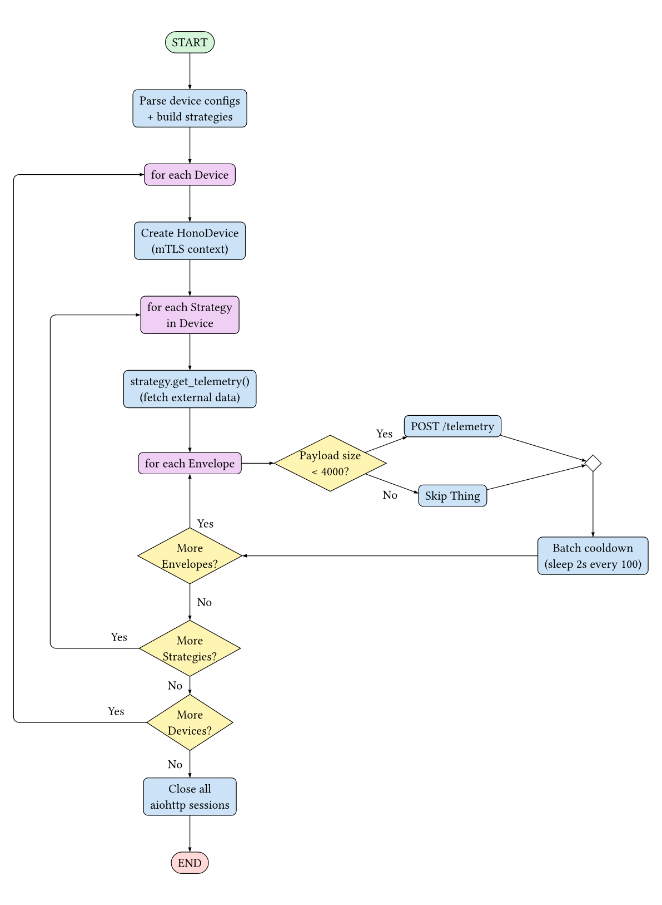
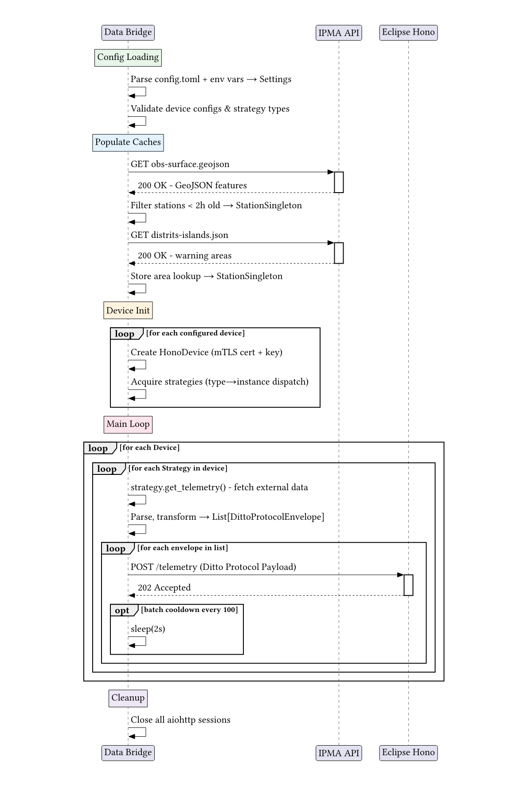
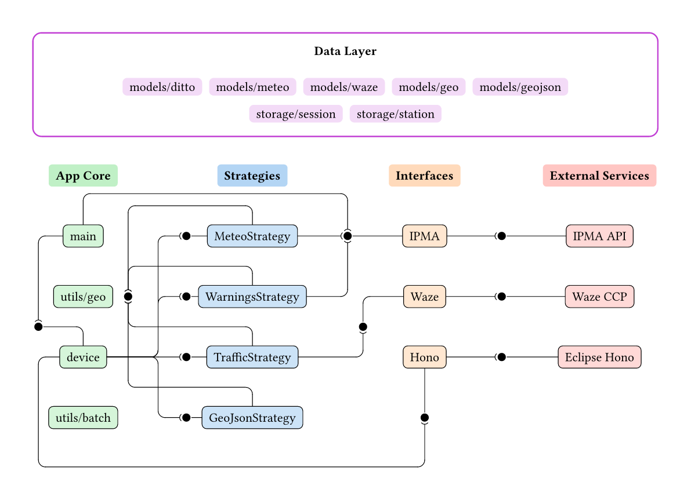

## Program's execution and main logic


The main program, as implemented currently, will behave as follows:



The main additions can be made by implementing more strategies, which can
modify the behavior of a given device. These strategies are responsible for creating Ditto
Protocol Envelope Messages, which the Device will send to Eclipse Hono, which
will then forward them to Eclipse Ditto. This protocol can be seen in [Eclipse
Ditto's official
documentation](https://eclipse.dev/ditto/protocol-overview.html), and the Data
Model for the encapsulation of this command is defined in `models/ditto.py`.

In addition, the sequence diagram of the main execution flow is as follows:




## Code Structure

The program is logically structured as follows:



> **_NOTE_**: For ease of understanding this diagram: This uses a `ball and
> socket` notation, where a ball represents providing an interface, and a socket
> represents consuming said interface. It is used to show the dependencies
> between internal components of the system (and interaction with external
> systems). The `App Core` column consists of the `main.py`,
> `devices/device.py` file and those contained within `utils.py`. The
> `Strategies` column consists of the files within the `strategies` directory
> and the `Interfaces` column consists of the files contained within the
> `interfaces` directory. For ease of understanding, the dependencies on the
> data layer were removed, but those files are contained within the `models`
> and `storage` directories.

In `main.py` several instances of `Device` are created, for each of the
configured devices. This class can be observed in `devices/device.py`.

This `Device` contains a batching mechanism that will wait 2 seconds between
sending 100 messages, to ensure that the instance of Eclipse Hono is not
overwhelmed with too many messages. This batching mechanism is imported from `utils/batch.py`

## Data Models

The data models in this project are all created using `Pydantic`'s `BaseModel`,
with Enums being created with Python's stdlib `Enum` class.

To see more about how to create a `Pydantic` model, consultation of their
[official
documentation](https://pydantic.dev/docs/validation/2.11/get-started/) is recommended.
However, the important concepts are that a new class has to be created that
extends the `BaseModel` class, and fields are defined within this new class,
along with their types. `Pydantic` is then responsible for the serialization
and deserialization of the model. Custom validators can be created with the
`@model_validator` function decorator.

For a matter of organization, it is expected that these models are created
within a new file in the `models/` directory, with a name that allows for the
ease of recognition on what the purpose of the models is.

## Singletons

For matters of caching, or having a common instance that needs to be share
among different classes in the project, such as the case of sharing a
`ClientSession` among the different interfaces, Singletons are used. These are
classes that internally contain a single instance of a given class and have
methods that allow access to such class. For the case of the `SessionSingleton`
present in `storage/session.py`, the instance mediates access to a single
`ClientSession` instance through the `get_session()` method defined as follows:

```python
@classmethod
def get_session(cls) -> ClientSession:
    if cls.client is None:
        cls.client = ClientSession()

    return cls.client
```

The singleton is responsible for creating the single instance in the case that
it does not exist, as well as closing and deleting said instance when no longer
required, through the `close_session()` method:

```python
@classmethod
async def close_session(cls) -> None:
    if cls.client:
        await cls.client.close()
        cls.client = None
```

Additionally, if needed, the singleton can also add logic before accessing the
shared resource, such as triggering a mutex or a lock to ensure no race
conditions in parallel access, as is the case of the `StationSingleton`:

```python
@classmethod
async def set_stations(cls, stations: List[Station]) -> None:
    async with cls._lock:
        cls._stations = set(stations)
```

There are currently two singletons implemented, in the `storage/` directory,
those being the `SessionSingleton` already mentioned and the `StationSingleton`.

With the `SessionSingleton` already described earlier, the `StationSingleton`
mediates access to a shared set of `Station` objects and a dictionary that
links a warning area's ID to the `WarningArea` object. Then it allows other
components to set the items in the set or the dictionary, as well as getting an
item from the dictionary, getting a given `WarningArea` object by its ID and
also getting the closest stations to a given point, given a radius.

## Interfaces

The concept of a `interface` in this program is not one of a standard interface
that defines the mandatory functions that need to be implemented. It is just
the definition of the contact with the outside world and is, for better or for
worse, tightly coupled with the `strategy` that uses it. As such, the
definition of this interface is left completely to the programmer. However,
some recommendations are left, namely the usage of the `SessionSingleton` class
to acquire a `aiohttp`'s `ClientSession` in the case that a REST API is used
for the data source. It is expected that the interface returns a custom Model
that has been defined in the previous section, and that the functions defined
in this interface are only called on the respective strategies.

Additionally, the guideline that all utility functions defined within the file
should be prefixed with an underscore (`_`) was followed, as well as the main
functions in the strategy being prefixed with `get`, as in
`get_meteorologic_data`, or `get_meteorologic_warnings`, for example.

For a matter of organization, it is expected that these classes are created
within a new file in the `interfaces/` directory, with a name that allows for the
ease of recognition on what the purpose of such an interface is.

### Hono Interface

The Hono interface is responsible for maintaining a `ClientSession` with the
provided Eclipse Hono instance and sending messages to its HTTP Adapter. The
messages are sent to the HTTP Adapter's `/telemetry` endpoint as a POST
request, with the message's contents being sent in the body of said request as
a JSON object.

Additionally, this interface is also responsible for loading the SSL/TLS
context of the configured device, as well as Eclipse Hono's x509 certificate in
the case that it is provided through the configuration.

Before making the request, the interface calculates the total size of the
message to be sent and, in the case that it is larger than 4k bytes, the
message is not sent as that would be larger than what Hono accepts. In the case
that the request returns any error code, the interface logs the error, but does
not attempt to send the request again.

### HonoMock Interface

The HonoMock interface is a debugging interface that instead of sending the
HTTP Request to Eclipse Hono, simply logs the JSON object that would be sent.

### IPMA Interface

The IPMA interface is responsible for interacting with IPMA's open API,
acquiring the stations, their measurements, the warning that IPMA provides and
the areas they affect. Additionally, it also provides functions to populate the
`StationSingleton` with the acquired meteorologic stations and warning areas.

When acquiring the meteorologic warnings, the interface filters to only keep
those whose warning is either "yellow" or "red", discarding those that are
classified as "gray" or "green".

### Waze Interface

The Waze interface is responsible for interacting with Waze's Connected
Citizens API, acquiring the Jams and Alerts noted in Waze's platform.

Waze's CCP API accepts a bounding box, and not a center point and radius as the
Data Bridge is configured. As such, the interface, given the configured center
and radius will calculate the limits of a rectangular area that circumscribes
the defined area. This is done by converting the search radius into its
equivalent distance in decimal degrees, which is then added and subtracted to
the coordinates of the center point. These newly calculated coordinates define
4 lines, whose intersection defines the bounding box that is sent to the API.

## Devices

The `Device` class, defined in `devices/device.py` contains the lifecycle of a
device. The class provides a `run` asynchronous method that will iterate
through the strategies configured in the device and execute their
`get_telemetry()` method. Then, for each `DittoProtocolEnvelope` returned, the
method `send_telemetry()` of the `HonoDevice` interface to send the message to
Eclipse Hono. After running the whole lifecycle, the `Device` class
automatically closes the `ClientSession` instantiated for that device.

## Strategies

This Data Bridge was built with the concept of ease of extensibility in mind,
and attempts to make it as simple as possible to create new modules responsible
for acquiring data from different sources, such as other relevant APIs that may
need to be used to add more information to the Digital Twin world
representation.

To do so, the concept of `Strategies` are used, getting their name from the
[Strategy Pattern](https://refactoring.guru/design-patterns/strategy), where a
family of algorithms is defined but interchangeable between them.

The process of creating a new data source revolves around creating a new
extension of the `BaseStrategy` class. In addition, it is also of note the
concept of an `interface`, which in this project is considered the act of
interacting with external services, and of a `model` which is where the
retrieved data is stored. As an example, we have the `ipma` interface (defined in `interfaces/ipma.py`), which is
responsible for all the interactions being made with the [IPMA
API](https://api.ipma.pt), and the `meteo` models (defined in
`models/meteo.py`) which contain all the data that is relevant to this
interaction, namely the meteorologic station, measurement and meteorologic
warning data modelling, along with the needed Enums and constants.

Another example is the `geojson` interface, responsible for interacting with
GeoJSON files in the file system.

To create a new data source, it is expected that first the data models are
defined, following by the interactions with the outside world and lastly the
definition of the strategy class itself.

Due to the interchangeability of these classes, they all extend the same base
class and have the same "interface" in the standard programming sense, where
each subclass must implement the asynchronous `get_telemetry(self) -> List[DittoProtocolEnvelope]` 
function.

The definition of this `BaseStrategy` class can be seen in the
[strategies/strategy.py](../strategies/strategy.py) file. The class must
mandatorily contain the following fields:

- `namespace`
- `subject`
- `policyId`

Which are to be set in the class's constructor (`__init__` function).
Additionally, the base class contains the following utility functions:

```python
    def _create_topic(
        self,
        thingName: str,
        channel: Channel = Channel.TWIN,
        criterion: Criterion = Criterion.COMMAND,
        action: Action | None = CommandAction.MODIFY,
    ) -> Topic:


    def _create_envelope(
        self,
        topic: Topic,
        attributes: dict[str, object] | None = None,
        features: Dict[str, Feature] | None = None,
        path: str = "/",
    ) -> DittoProtocolEnvelope:


    def _create_envelope_raw(
        self,
        message_topic: Topic,
        value: Any = None,
        path: str = "/",
    ) -> DittoProtocolEnvelope:
```

Which aid in the creation of the DittoProtocolEnvelope.

Lastly, upon creation of the new `Strategy` class, the file
[strategies/__init__.py](../strategies/__init__.py) should be altered to allow
for the configuration of this new strategy from the `config.toml` config file.

To do so, a new class prefixed with underscore shall be created that defines
the fields required by the strategy. In addition, this class MUST extend the
`_BaseType` class defined in that file and MUST be added to the `StrategyType`
type union. It is mandatory that this newly created class contains the field
`type`, which is to be set as a string literal.

As an example of the creation of such class is the `_GeoJSON` class, which
allows for the definition of the `GeoJsonStrategy` in the configuration file:

```python

class _GeoJson(_BaseType):
    type: Literal["geojson"] = "geojson"
    dir: str | None = None
    file: str | None = None

    @model_validator(mode="after")
    def validate_fields(self) -> Self:
        if (self.dir is None) == (self.file is None):
            raise ValueError(
                "A GeoJson strategy must either have files or directories, not both"
            )
        return self

StrategyType = Annotated[
    Union[_Meteo, _Traffic, _GeoJson, _MeteoWarnings], Field(discriminator="type")
]
```


Lastly, the instantiation of the strategy MUST be added to the
`_type_to_strategy()` function, also defined in the same file. To do so, a new
entry in the `match` statement, matching against the class type has to be
added, which returns the instantiation of the object.

As an example:
```python
def _type_to_strategy(
    type: StrategyType,
    policyId: str,
    namespace: str,
) -> BaseStrategy:
    match type:
        (...)
        case _GeoJson():
            return GeoJsonStrategy(
                namespace, type.subject, policyId, type.dir, type.file
            )
```

Given all this, the configuration of the strategy in the configuration file is
automatically handled by the data bridge, and no more changes need to be made.

Following this, the concrete implementation of all strategies is specified.

### Meteorologic Strategy

The meteorologic strategy is responsible for querying IPMA's open API and
retrieving the measurements taken from it's meteorologic stations.

The execution flow of this strategy is as follows:


As defined by `BaseStrategy`, this class has a `get_telemetry` method which,
when called, will make a `GET` request to IPMA's open API, and retrieve a
GeoJSON file which contains not only the measurements of all the online
stations, but also some attributes about said stations, namely the location and
city where they are located.

From this acquired data, the stations are filtered such that only stations
contanining recent measurements (those taken under 2 hours) are kept.
Adititonally, the `StationsSingleton`, which acts as a cache for the Station's
locations, is updated.

Then, for each station contained in the retrieved GeoJSON file, a
`DittoProtocolEnvelope` instance is created and added to an array, which will
then be returned to the main execution loop for a `Device` instance to send to
Eclipse Hono.

As common in other Digital Twins created, the fields `geotile` and `expiry_ts`
are added to the Thing, aiding in searching for Things in a given geographic
area, as well as enabling the garbage collector system to delete unused and
out-of-date things.

### Meteo Warnings Strategy


The meteorologic strategy is responsible for querying IPMA's open API and
retrieving the warnings that were attributed to each region of the country.

The execution flow of this strategy is as follows:


As of currently, this strategy assumes that StationSingleton has already been
populated with the existing meteorologic strategies and warning areas, which is
currently being done at the beginning of the program. From here, for each
active warning, the warning area is retrieved from the singleton, and its
location is used to calculate the 3 closest stations, and the warnings are
grouped by these stations.

Then, for each station, a `modify` command `DittoProtocolEnvelope` is
instantiated and added to an array, which is then returned for the main
execution flow for a instance of `Device` to send to Eclipse Hono.

As common in other Digital Twins created, the fields `geotile` and `expiry_ts`
are added to the Thing, aiding in searching for Things in a given geographic
area, as well as enabling the garbage collector system to delete unused and
out-of-date things.

### Traffic Strategy

The traffic strategy is responsible for querying Waze's Connected Citizens
Program API and retrieving the current `alerts` and `jams` recorded in Waze.

The execution flow of this strategy is as follows:


After acquiring the data from the interface, it proceeds to first create a
`DittoProtocolEnvelope` for creating or modifying a Thing, followed by creating
a message to modify the `alerts` feature on said Thing and lastly looping
through all the jams and creating a separate message for modifying the
`jams` feature.
This is done this way because in the case of the `jams`, due to the geometry
field of the jam, the message itself can become quite large and going over  the
Eclipse Hono size limit. Doing a separate message per jam ensures that the
message does not go over the limit and, if it goes, only a single Jam is lost,
and not the  entire update to the Thing.

All of the produced envelopes are added to an array, which is then returned to
the main execution flow for a instance of `Device` to send to Eclipse Hono.

As common in other Digital Twins created, the fields `geotile` and `expiry_ts`
are added to the Thing, aiding in searching for Things in a given geographic
area, as well as enabling the garbage collector system to delete unused and
out-of-date things.


### GeoJSON Strategy

This strategy differs from the remaining because the data source used comes
from the local file system instead of being obtained from a HTTP request.
To this strategy either a file or directory is provided, and it will read the
file(s) and from this extract the features contained within the file.

The execution flow of this strategy is as follows:


The `name` field of the GeoJSON is used to name the Things that are to be
created/updated. From the `features` array, the `properties` and `geometry`
fields are used to populate the attributes of the Thing.

This strategy was created with the intention of handling GeoJSON files whose
coordinates are in the `ETRS89` projection, meaning that it also converts said
coordinates to `WGS84` , as that is the projection that is currently being used
by the system.

As common in other Digital Twins created, the fields `geotile` and `expiry_ts`
are added to the Thing, aiding in searching for Things in a given geographic
area, as well as enabling the garbage collector system to delete unused and
out-of-date things.
